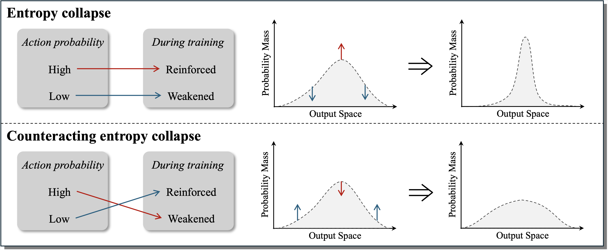

# Offline Exploration-Aware Fine-Tuning for Long-Chain Mathematical Reasoning

This repo contains the official implementation for the paper ["Offline Exploration-Aware Fine-Tuning for Long-Chain Mathematical Reasoning"](https://arxiv.org/abs/2603.16206). 

## 📢 News

- **[2026/03/18]** We released our training and evaluation [codebase](https://github.com/takagi97/OXA-Fine-tuning).
- **[2026/03/18]** We released [the paper](https://arxiv.org/abs/2603.16206).

## 📝 Introduction

Through encouraging self-exploration, reinforcement learning from verifiable rewards (RLVR) has significantly advanced the mathematical reasoning capabilities of large language models. As the starting point for RLVR, the capacity of supervised fine-tuning (SFT) to memorize new chain-of-thought trajectories provides a crucial initialization that shapes the subsequent exploration landscape. However, existing research primarily focuses on facilitating exploration during RLVR training, leaving exploration-aware SFT under-explored. 

To bridge this gap, we propose **Offline eXploration-Aware (OXA)** fine-tuning. Specifically, OXA optimizes two objectives: promoting low-confidence verified teacher-distillation data to internalize previously uncaptured reasoning patterns, and suppressing high-confidence incorrect self-distillation data to redistribute probability mass of incorrect patterns toward potentially correct candidates. Experimental results across 6 benchmarks show that OXA consistently improves mathematical reasoning performance, especially achieving an average gain of $+6$ Pass@1 and $+5$ Pass@$k$ points compared to conventional SFT on the Qwen2.5-1.5B-Math. Crucially, OXA elevates initial policy entropy, and performance gains persist throughout extensive RLVR training, demonstrating the long-term value of OXA.



## 🚀 Quick Start

Our code is built upon [LLaMA-Factory](https://github.com/hiyouga/LLaMA-Factory), [Transformers](https://github.com/huggingface/transformers), [VeRL](https://github.com/verl-project/verl), and [DeepScaleR](https://github.com/rllm-org/rllm/tree/deepscaler).

> [!IMPORTANT]
> **Environment Management:** To avoid dependency conflicts, environments for each stage are isolated and installed via their respective startup scripts. Specifically:
> * **SFT Scripts:** Automatically install `LLaMA-Factory` and `Transformers`.
> * **RL Scripts:** Automatically install `VeRL`.
> * **Evaluation Scripts:** Automatically install `DeepScaleR`.
> 
> You can set up a base environment first using the following command; the scripts will then handle the specific requirements for each module.

```bash
pip install -r requirements.txt
```

## 🛠️ Pointers

### Scripts

* **[1. Prepare SFT Data](1-prepare_sft_data)** First, calculate the PPL for the distilled results using `1-prepare_sft_data/cal_ppl`. Data preparation then follows:
    * **Baseline SFT_LP:** (Selecting low-PPL samples) Use `make_SFT_LP_data.py` and `post_process_SFT_LP_data.py`.
    * **Baseline SFT:** (Random distribution) Standard random sampling.
    * **OXA_MLE:** (Gaussian-based sample filtering via PPL) Use `make_OXA_MLE_data.py` and `post_process_OXA_MLE_data.py`.
    * **OXA_FULL:** Includes OXA_MLE data and `ulloss` data. Use `make_OXA_MLE_data.py`, `make_ULloss_data.py`, and `concat_and_post_process_OXA_FULL_data.py`.


* **[2. Train Base models to SFT models](2-fine-tuning)** Training scripts are located in `2-fine-tuning/train-scripts`. Launch via `train.sh` using the provided configuration files.
*Note:* SFT and SFT_LP use identical configurations. We modified `max_position_embeddings` and `rope_theta` in `config.jsonl`, and removed the default system prompt in `tokenizer_config.json`. All modified configs are provided.

* **[3. RLVR Training](3-reinforcement-learning)**
Training scripts are in `3-reinforcement-learning/train-scripts`. All SFT models share the same training and validation sets located in `3-reinforcement-learning/train-data`.

* **[4. Evaluation](4-evaluation)**
Run `4-evaluation/ex-eval.sh`. This script automatically initializes 8 `vLLM` servers across 8 GPUs for concurrent inference and scoring.

### Training Datasets

* **SFT Datasets:** We matched the original AceReason-1.1 dataset with ground-truth answers and verified the correctness of R1 responses. Only verified correct responses were kept for PPL calculations and subsequent stages. Check the processed dataset here: [takagi97/OXA-AceReason-1.1-Math](https://huggingface.co/datasets/takagi97/OXA-AceReason-1.1-Math).
* **RL Datasets:** Training and testing sets used for RL are located in `3-reinforcement-learning/train-data`.

## ❤️ Acknowledgements

We extend our sincere gratitude to the teams behind LLaMA-Factory, Transformers, VeRL, and DeepScaleR for their foundational contributions to the community.

## 📜 Citation

If you find our work helpful, please kindly cite us as:

```bibtex
@article{mu2026offline,
  title={Offline Exploration-Aware Fine-Tuning for Long-Chain Mathematical Reasoning},
  author={Mu, Yongyu and Zeng, Jiali and Meng, Fandong and Zhu, Jingbo and Xiao, Tong},
  journal={arXiv e-prints},
  pages={arXiv--2603},
  year={2026}
}
```
